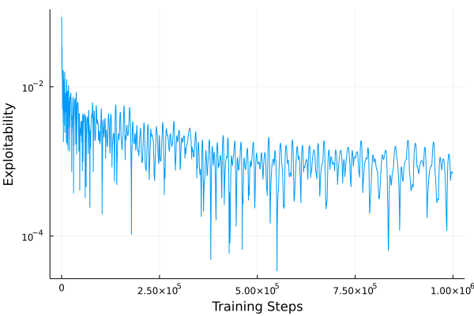
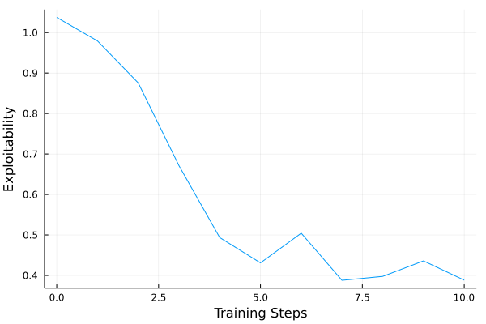

# ESCHER.jl

[ESCHER](https://arxiv.org/abs/2206.04122) : Eschewing Importance Sampling in Games by Computing a History Value Function to Estimate Regret

```julia
using CounterfactualRegret
const CFR = CounterfactualRegret
using CounterfactualRegret.Games
using ESCHER
using Plots

game = Kuhn() # use Kuhn Poker from CounterfactualRegret.Games

sol = TabularESCHERSolver(game)

# optional training callback
cb = CFR.ExploitabilityCallback(sol, 100) # evaluate exploitability every 100 steps

# train for 1_000_000 iterations
train!(sol, 1_000_000; cb=cb)
plot(cb;yscale=:log10)
```



```julia
using Flux
sol = ESCHERSolver(game;
    trajectories            = 1_000,
    value_batches           = 500,
    regret_batches          = 500,
    strategy_batches        = 500,
    value_batch_size        = 256,
    regret_batch_size       = 256,
    strategy_batch_size     = 256,
    value_buffer_size       = 100_000,
    regret_buffer_size      = 1_000_000,
    strategy_buffer_size    = 1_000_000,
    value       = Chain(Dense(5,32,relu), Dense(32,32,relu), Dense(32,1,identity)),
    regret      = Chain(Dense(5,32,relu), Dense(32,32,relu), Dense(32,2,identity)),
    strategy    = Chain(Dense(5,32,relu), Dense(32,32,relu), Dense(32,2,identity), softmax),
    optimizer   = Adam(1e-2),
    gpu         = true
)

cb = CFR.ExploitabilityCallback(sol, 1) # evaluate exploitability every step
train!(sol, 10; cb=cb)
plot(cb)
```

